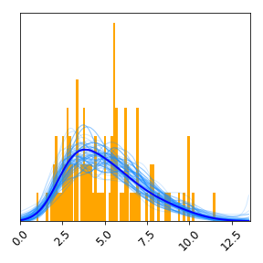

========
Tutorial
========

We being by loading NumPy, PyPlot, SUFTware::

    import numpy as np
    import matplotlib.pyplot as plt
    import suftware as sw

    # Enable interactive plotting
    plt.ion()

Next we simulate data from a Gamma distribution::

    # Generate data from a Gamma distribution
    np.random.seed(0)
    data = np.random.gamma(shape=5, scale=1, size=100)

To estimate the probability density, do this::

    # Perform DEFT density estimation using SUFTware
    density = sw.DensityEstimator(data)

This creates an instance of the ``sw.DensityEstimator`` class.
The DEFT density estimation algorithm is run as part as part of this
object's initialization process.

To quickly view the estimated probability density, use ``density.plot()``::

    # Plot density estimate using built-in plotting routine and save to file
    density.plot()

This will create a matplotlib figure resembling the one
below. A histogram of the data is shown in orange, the optimal density estimate
is shown in blue, and plausible densities are shown in light blue.
Because the optional ``save_as`` argument is set, this plot is also
saved to a PNG file. Other optional arguments to ``density.plot()`` can be used
to specify styling options. See :doc:`documentation` for more information.

DEFT estimates each probability distribution on a grid contained within
a finite bounding box. Both the bounding box and the grid were
set automatically in this example, but these as well as other grid
characteristics can be set by the user by passing additional parameters to
the ``DensityEstimator`` constructor. See :doc:`documentation` for more
information.

Information about the grid and bounding box are stored in the
attributes of ``density``:

- ``density.bounding_box``: Lower and upper edges of the bounding box.
- ``density.grid``: Locations of the gridpoints used.
- ``density.grid_spacing``: Distance between neighboring grid points.
- ``density.num_grid_points``: Number of grid points used.

The values of the optimal density estimate at each grid point are stored
in ``density.values``. The ``density.evaluate()`` method allows this density to
be evaluated at any other set of locations. The ensemble of posterior-sampled
densities can be evaluated in a similar manner. Note that all estimated
distributions evaluate to zero outside of the bounding box::

    # Create new grid
    new_grid = np.linspace(-5,20,10000)

    # Evaluate optimal density on new grid
    new_values = density.evaluate(new_grid)

    # Evaluate sampled densities on new grid
    new_sampled_values = density.evaluate_samples(new_grid)

    # Create figure
    plt.figure(figsize=[4,4])

    # Plot optimal and posterior-sampled densities
    plt.plot(new_grid, new_sampled_values, color='dodgerblue', alpha=.1)
    plt.plot(new_grid, new_values, color='blue')

    # Draw lines indicating bounding box
    plt.axvline(density.bounding_box[0], linestyle='--', color='black')
    plt.axvline(density.bounding_box[1], linestyle='--', color='black')

    # Show plot
    plt.tight_layout()
    plt.savefig('tutorial_2.png')
    plt.show()

.. image:: resources/tutorial_2.png
   :height: 300px
   :width: 300 px
   :alt: Custom plot of density estimates.

See :doc:`documentation` for more information on the SUFTware API.